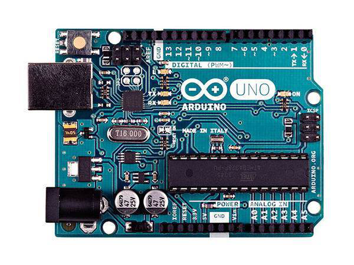

# 系统控制与结果查询

# 系统设计

## 设计目的

光污染是继废水、废气、废渣和噪声等污染之后的一种新的环境污染源。光污染不仅仅严重影响了人类的身体健康和其他生物的自然生活规律。除此之外，光污染还对科学探测特别是天文观测产生了严重的影响。

新《中华人民共和国环境保护法》（2015年）中第四十二条明确规定，要防治企业事业单位在生产中产生的包括光污染在内的多种污染。由此可见，我国渐渐认识到了光污染的严重危害，保护环境、治理光污染势在必行。

我们利用在单片机课程上学到的知识，用arduino单片机制作一个可以对光污染进行探测和分析的探测仪器，不仅可以帮助人们保护身体健康，践行绿色环保可持续的发展理念，而且可以在科学探测中保障探测结果的准确。

# 系统功能

基于arduino的光污染探测分析仪具备以下功能：

1. 对整个空间的光强情况进行扫描，寻找出空间中光强最大的方向，也就是污染源的方向。

2. 对于光强探测的结果，既能输出准确的数值，也能进行可视化输出。

2. 网络查询功能：用树莓派做一个服务器，搭建一个网页，用户可以在网页上对探测器进行控制，探测器可以把扫描得到的空间中的光强分布以图片的形式发送到网页上，并且可以对光强最大的污染源拍照并且发送到网页上，方便用户查询。


# 主要硬件介绍

## Arduino uno 开发板：

以ATmega328 MCU控制器为基础，具备14路数字输入/输出引脚(其中6路可用于PWM输出)、6路模拟输入、一个16MHz陶瓷谐振器、一个USB接口、一个电源插座、一个ICSP接头和一个复位按钮。它采用Atmega16U2芯片进行USB到串行数据的转换。它包含了组成微控制器的所有结构，同时，只需要一条USB数据线连接至电脑。目前，Arduino Uno已成为Arduino主推的产品。



## 树莓派3代B+型

这是树莓派的最新型号，主要参数chaxub如下：

* 博通BCM2837B0 SoC，集成四核ARM Cortex-A53（ARMv8）64位@ 1.4GHz CPU，集成博通 Videocore-IV GPU

* 内存：1GB LPDDR2 SDRAM

* 有线网络：千兆以太网（通过USB2.0通道，最大吞吐量 300Mbps）

* 无线网络:2.4GHz和5GHz 双频Wi-Fi，支持802.11b/g/n/ac

* 蓝牙：蓝牙4.2&低功耗蓝牙（BLE）

* 存储：Micro-SD

* 其他接口：HDMI，3.5mm模拟音频视频插孔，4x USB 2.0，以太网，摄像机串行接口（CSI），显示器串行接口（DSI），MicroSD卡座，40pin扩展双排插针

* 尺寸：82mmx 56mmx 19.5mm，50克


## SG90舵机

* 反应转速：0.12~0.13秒/60°；
* 工作扭矩：1.6KG/CM；
* 转动角度：180°


## 光强模块GY-30

通过光敏电阻的原理对光强进行探测，光强越大，电流越小。


# 硬件设计思路和电路图

## 硬件设计思路

1. 将两个舵机按照转轴相互垂直的方向粘合起来，再把四个光强传感器组成探头粘在上方的舵机的转臂上。这样使得探头能够具有四个自由度，可以扫描整个空间。
2. 舵机的转速通过arduino的PWM输出引脚输出PWM信号控制。、
3. 在探头上加一个树莓派专用的摄像头，用于对光污染源拍照。将摄像头和树莓派相连，从而可以将拍到的照片通过树莓派传输的网页端。

## 电路图

## 探测器整体图


# 软件设计思路

## 软件设计

项目主要硬件可以划分为两个部分。arduino部分和raspberry pi部分。两个部分分别是不同的硬件架构。arduino是基于avr的单片机，然而，树莓派是基于arm架构的cpu。
硬件架构的不同导致主要的软件也被划分两部分，再加上显示在用户端的HTML，本项目的软件部分可以划分为三部分。

### arduino部分

arduino主要负责硬件的控制与软件的采集。arduino通过串口接受来自树莓派的指令。

当arduino接收到树莓派的执行光污染源寻找指令时。arduino执行相关函数，首先通过pwm信号操纵水平方向舵机与竖直方向舵机进行转动，转动到初始位置。然后读取光强传感器阵列的数据。之后主次扫描过均匀分布的100各点。并从中找到光强最大的点，并记录位置。然后控制舵机旋转至该位置，然后传送信息至arduino。

当arduino接收到进行全角度扫描时，arduino将控制舵机转动至初始位置。然后开始对空间当中逐点扫描，每转到一个空间位置，遂及测量该点的亮度。并实时传回树莓派，直到遍历空间之中的所有点。扫描完毕之后将结束信号回传。

### 树莓派部分

树莓派作为整个仪器与用户之间的接口，是非常重要的。树莓派对外作为一个web服务器，负责给用户的浏览器分发内容，通过互联网接受用户指令，并根据不同指令返回用户结果或操纵单片机进行相关动作的执行。

#### web服务端采用nginx+uwsig+flask架构

Nginx 是一个很强大的轻量级的高性能Web和反向代理服务器。非常适合在树莓派上用于搭建小型网站。

uWSGI是一个Web服务器，它实现了WSGI协议、uwsgi、http等协议。Nginx中HttpUwsgiModule的作用是与uWSGI服务器进行交换。WSGI是一种Web服务器网关接口。它是一个Web服务器（如nginx，uWSGI等服务器）与web应用（如用Flask框架写的程序）通信的一种规范。uwsgi用于nginx与flask之间的通讯。

Flask是一个Python编写的Web 微框架，让我们可以使用Python语言快速实现一个网站或Web服务。flask在本项目之中可以用作动态网页服务器。用户浏览器发出的指令是由flask处理并执行。

本项目之中树莓派与arduino之间的互动是由python语言完成的。在python中导入了pyserial串口通讯模块用于与arduino通讯。还引入了numpy与matplotlib模块用于处理数据并画图。

# 系统技术测试

经过测试，光强探测器运行一切正常。探测器的探头可以扫描到探头上方整个空间，并且能够绘制出空间中的光强分布。如下图所示：


经过多次测试，探测器的光源寻找功能也能正常工作。能够用树莓派把拍摄到的照片传到网页上。如下所示：


我们根据探测到的光强的范围，设置了一个光强标准，光强范围为0~1000，数值越大，广强越强。
# 软件源代码

## arduino部分

### f7.h
``` C
#include <Servo.h>
struct pw
{
    int x;
    int y;
    float l;
    struct pw * next;
};

struct pw * h = NULL;
int a0;
int a1;
int b0;
int b1;
Servo s0;
Servo s1;
char com;
```

### f7.ino

``` C
#include "f7.h"
void readlight();
void findmaxq();
void saomiao();
void sf();
void showlight();
void setup()
{
    // 初始化舵机和串口
    s0.attach(7);
    s1.attach(8);
    Serial.begin(9600);
}
void loop()
{
    if (Serial.available())
    {
        com=Serial.read();

        switch (com)
        {
            case 's':
                saomiao();
                break;
            case 'f':
                findmaxq();
                break;
            case 'q':
                sf();
                break;
            case 'l':
                showlight();
                break;
            default:
                Serial.println("bad com");
                break;
        }
    }
}
void readlight()
{
    // 光强获取函数。
    a0=analogRead(A0)-5;
    a1=analogRead(A1)+5;
    b0=analogRead(A2)-5;
    b1=analogRead(A3)+5;
}
void saomiao()
{
    // 光强扫描函数
    float l;
    int i,j;

    for( i = 0; i < 180; i++)
    {

        for( j = 0; j < 180; j++)
        {
            delay(10);
            s0.write(i);
            delay(10);
            s1.write(j);
            delay(5);
            readlight();
            l=(a0+a1+b0+b1);
            Serial.print(l,2);
            Serial.print(',');
        }
        Serial.print('\n');
        delay(10);
    }


}

void findmaxq()
{
    // 空间光强极值获取函数。
    int flog1=0;
    int flog2=0;
    int i=90;
    int j=90;
    s0.write(i);
    s1.write(j);
    for(int ip = 0; ip <= 4096; ip++)
    {
        readlight();
        delay(2);

        if (a0>(a1+3))
        {
            // i++;
            if (i<=179)
            {
                i++;
            }
            else
            {
                flog1=1;
            }
        }
        if (a0<(a1-3))
        {
            // i--;
            if (i>=1)
            {
                i--;
                Serial.print("*");
            }
            else
            {
                flog1=1;
            }
        }
        if ((a0<=(a1+3))&&(a0>=(a1-3)))
        {
            flog1=1;
        }
        Serial.print(i);
        Serial.print(',');
        Serial.print(flog1);
        Serial.print(',');
        s0.write(i);
        if (b0>(b1+3))
        {
            // j++;
            if (j<=179)
            {
                j++;
            }
            else
            {
                flog2=1;
            }
        }
        if (b0<=(b1-3))
        {
            // i--;
            if (j>=1)
            {
                j--;
            }
            else
            {
                flog2=1;
            }
        }
        if (b0<=(b1+3)&&b0>=(b1-3))
        {
            flog2=1;
        }
        Serial.print(flog2);
        Serial.print(',');
        Serial.println(j);
        s1.write(j);
        if (flog1==1&&flog2==1)
        {
            Serial.println('p');
            Serial.print(i);
            Serial.print(',');
            Serial.print(j);
            break;
        }
    }
}
void sf()
{
    // 光强极大值扫描函数
    float l,ml;
    int i,j;
    int mx,my;
    ml=100000;
    mx=0;
    my=0;
    for( i = 0; i <= 180; i=i+10)
    {

        for( j = 0; j < 180; j=j+10)
        {
            delay(10);
            s0.write(i);
            delay(10);
            s1.write(j);
            delay(100);
            readlight();
            l=(a0+a1+b0+b1);
            // Serial.print(l,2);
            // Serial.print(',');
            if (ml>=l)
            {
                ml=l;
                mx=i;
                my=j;
            }
        }
        // Serial.print('\n');
        delay(10);
    }
    delay(1000);
    s0.write(mx);
    s1.write(my);
    delay(20);
    Serial.println('p');


}
void showlight()
{
    float l;
    readlight();
    delay(10);
    l=a0+a1+b0+b1;
    Serial.println(l);
    delay(2);
}

```

## 树莓派部分

### ardlib.py

单片机操纵模块

``` python
#!/usr/bin/env python3
import serial
import numpy as np
import os
import time
import datetime
import shutil
import matplotlib
matplotlib.use("Pdf")
import matplotlib.pyplot as plt

class ard(object):
#面向对象的编程语言
    def __init__(self):#初始化函数
        self.ser=serial.Serial('/dev/ttyUSB0', 9600)
        time.sleep(1)
        sser=self.ser
        try:
            sser.open()
        except:
            pass
    def saomiao(self):#扫描函数
        nmp=np.zeros([180,180])
        self.nowTime=str(datetime.datetime.now().strftime('%Y%m%d%H%M%S'))
        sser=self.ser
        sser.write('s'.encode())
        sser.flushInput()
        for i in range(0,180):
            time.sleep(1)
            shi = str(sser.readline())
            shi=shi[2:len(shi)-5]
            shi=shi.strip()
            shi=shi.split(',')
            nmp[i,:]=np.array(shi)
            pass
        p=os.path.abspath('.')
        ba=os.popen('mkdir '+p+'/static/res2/'+self.nowTime)
        time.sleep(0.001)
        plt.figure(dpi=500)
        plt.imshow(nmp)
        plt.title('space')
        plt.colorbar()
        plt.savefig('data.jpg')
        b=os.popen('cp data.jpg '+p+'/static/res2/'+self.nowTime)
        shutil.copyfile('./static/res2.html','./static/res2/'+self.nowTime+r'/res.html')


    def qfm(self):#光强最大值寻找函数
        self.nowTime=str(datetime.datetime.now().strftime('%Y%m%d%H%M%S'))
        sser=self.ser
        time.sleep(1)
        sser.write(b'q')
        self.takephoto()
        p=os.path.abspath('.')
        print(p)
        p2=os.path.join(p,'/static/res1/'+self.nowTime+r'/res1.html')

        b=os.popen('mkdir '+p+'/static/res1/'+self.nowTime)
        time.sleep(0.001)
        a=os.popen('touch '+p+p2)
        print(b)
        print(a)
        print(p+p2)
        with open(p+p2,'w') as f:
            f.write('dog\n'+self.nowTime)
            shutil.copyfile('./static/res1.html','./static/res1/'+self.nowTime+r'/res.html')
    def takephoto(self):#拍照函数
        timedog=time.strftime('%Y-%m-%d %H:%M:%S',time.localtime(time.time()))
        str = os.popen("echo takephoto"+timedog).read()
        print(str)
        pass
    def test(self):
        print("OK")
        pass

    pass

```

### testlib.py

测试模块

``` python
mport time
import datetime
import os
import shutil

class testlib(object):
    def __init__(self):
        self.nowTime=str(datetime.datetime.now().strftime('%Y%m%d%H%M%S'))
        pass
    def tes1(self):
        self.nowTime=str(datetime.datetime.now().strftime('%Y%m%d%H%M%S'))
        print("开始执行全域扫描")
        p=os.path.abspath('.')
        print(p)
        p2=os.path.join(p,'/static/res1/'+self.nowTime+r'/res1.html')
        # os.mkdir(os.path.join(p,'/static/res1/'+self.nowTime))
        b=os.popen('mkdir '+p+'/static/res1/'+self.nowTime)
        time.sleep(0.001)
        a=os.popen('touch '+p+p2)
        print(b)
        print(a)
        print(p+p2)
        with open(p+p2,'w') as f:
            f.write('dog\n'+self.nowTime)
            shutil.copyfile('./static/res1.html','./static/res1/'+self.nowTime+r'/res.html')

    def tes2(self):
        print("开始寻找光污染源")
        pass
    def test3(self):
        return self.nowTime
    pass

```

### fweb.py

互联网模块

``` python

import numpy as np
from flask import (Flask, abort, flash, redirect, render_template, request,
                   url_for)
import datetime
from ardlib import *
from testlib import *
import json
import os

app = Flask(__name__)

@app.route('/')
def hello_world():
    nowTime=datetime.datetime.now().strftime('%Y-%m-%d %H:%M:%S')
    a=[]
    a.append(nowTime)
    a.append("you are a dog")
    return render_template('test.html',time=a)

@app.route('/fweb',methods=['GET', 'POST'])
def fweb():
    if request.method == 'POST':
        s.tes1()
    else:
        abort(403)

    # s=ard()

    # s.qfm()
    # abort(401)
    return "dog"

@app.route('/test1/',methods=['GET', 'POST'])
def test1():
    if request.method == 'POST':
        print("666")
        s.tes1()
        return redirect(url_for('hello_world'))
    else:
        abort(403)

@app.route('/test2/',methods=['GET', 'POST'])
def test2():
    if request.method == 'POST':
        s.tes2()
    else:
        abort(403)
    pass


@app.route('/real1',methods=['GET','POST'])
def real1():
    if request.method == 'POST':
        ss=ard()
        a=ss.qfm()
        return redirect(url_for('hello_world'))
    else:
        abort(403)

@app.route('/real2',methods=['GET','POST'])
def real2():
    if request.method == 'POST':
        ss=ard()
        time.sleep(1)
        a=ss.saomiao()
        return redirect(url_for('hello_world'))
    else:
        abort(403)

@app.route('/res1')
def res1():
    a=os.listdir('./static/res1/')
    bu=sorted(a,reverse = True)
    return render_template('result.html',urls=bu)

@app.route('/res2')
def res2():
    a=os.listdir('./static/res2/')
    bu=sorted(a,reverse = True)
    return render_template('result2.html',urls=bu)

if __name__ == '__main__':
    app.run(debug=True,host='0.0.0.0')
```

## HTML部分

### result.html

结果显示模块

``` html
<!DOCTYPE html>
光强测试结果
<ul>
    
    <li>{{url}}</li><a href="/static/res1/{{url}}/res1.html">{{url}}</a>
    
</ul>

```

``` html
<!DOCTYPE html>
全域扫描结果
<ul>
    
    <li>{{url}}</li><a href="/static/res2/{{url}}/res.html">{{url}}</a>
    
</ul>

```

### test.html

测试页

``` html
<!DOCTYPE html>
<!-- <form>
    First name: <input type="text" name="firstname"><br>
    Last name: <input type="text" name="lastname">
</form>

<form name="input" action="/fweb" method="post">
    Username: <input type="text" name="user">
    <input type="submit" value="Submit">
</form>

<title>My Application</title>

  
    <ul class=flashes>
    
      <li>{{ message }}</li>
    
    </ul>
  

 -->


<html>
<!-- <head> 
<meta charset="utf-8"> 
<title>菜鸟教程(runoob.com)</title> 
</head> -->
<body>

<form action="/test1" method="post" onclick="alert('光强测试请求已受理，请稍后查看结果。')">
<input type="button" value="开始光强测试">
	</form>

</body>
</html>

<button type="button" action="/fweb" method="post" onclick="alert('你好，世界!')">点我!</button>


<form name="input" action="/test1" method="post" onclick="alert('光强测试请求已受理，请稍后查看结果。')">
  <input type="submit" value="Submit">
</form>

<form name="input" action="/real1" method="post" onclick="alert('光强测试请求已受理，请稍后查看结果。')">
  <input type="submit" value="光源寻找">
</form>
<form name="input" action="/real2" method="post" onclick="alert('光强测试请求已受理，请稍后查看结果。')">
  <input type="submit" value="全域扫描">
</form>
<a href="/res1">光源寻找结果</a>

<br>

<a href="/res2">全域扫描结果</a>

```

### index.html

主页

``` HTML
<!DOCTYPE html>
<html lang="en">
    <head>
        <meta charset="utf-8">
        <meta http-equiv="X-UA-Compatible" content="IE=edge">
        <meta name="viewport" content="width=device-width, initial-scale=1.0">
        <meta name="description" content="None">


        <link rel="shortcut icon" href="./img/favicon.ico">
        <title>光强传感器</title>
        <link href="./css/bootstrap-custom.min.css" rel="stylesheet">
        <link href="./css/font-awesome-4.5.0.css" rel="stylesheet">
        <link href="./css/base.css" rel="stylesheet">
        <link rel="stylesheet" href="./css/highlight.css">
        <!-- HTML5 shim and Respond.js IE8 support of HTML5 elements and media queries -->
        <!--[if lt IE 9]>
            <script src="https://oss.maxcdn.com/libs/html5shiv/3.7.0/html5shiv.js"></script>
            <script src="https://oss.maxcdn.com/libs/respond.js/1.3.0/respond.min.js"></script>
        <![endif]-->

        <script src="./js/jquery-1.10.2.min.js"></script>
        <script src="./js/bootstrap-3.0.3.min.js"></script>
        <script src="./js/highlight.pack.js"></script>
    </head>

    <body class="homepage">

        <div class="navbar navbar-default navbar-fixed-top" role="navigation">
    <div class="container">

        <!-- Collapsed navigation -->
        <div class="navbar-header">
            <a class="navbar-brand" href=".">光强传感器</a>
        </div>

        <!-- Expanded navigation -->
        <div class="navbar-collapse collapse">

            <ul class="nav navbar-nav navbar-right">
                <li>
                    <a href="#" data-toggle="modal" data-target="#mkdocs_search_modal">
                        <i class="fa fa-search"></i> Search
                    </a>
                </li>
            </ul>
        </div>
    </div>
</div>

        <div class="container">
                <div class="col-md-3"><div class="bs-sidebar hidden-print affix well" role="complementary">
    <ul class="nav bs-sidenav">
        <li class="main active"><a href="#_1">系统控制与结果查询</a></li>
        <li class="main "><a href="#_2">系统设计</a></li>
            <li><a href="#_3">设计目的</a></li>
        <li class="main "><a href="#_4">系统功能</a></li>
        <li class="main "><a href="#_5">主要硬件介绍</a></li>
            <li><a href="#arduino-uno">Arduino uno 开发板：</a></li>
            <li><a href="#3b">树莓派3代B+型</a></li>
            <li><a href="#sg90">SG90舵机</a></li>
            <li><a href="#gy-30">光强模块GY-30</a></li>
        <li class="main "><a href="#_6">硬件设计思路和电路图</a></li>
            <li><a href="#_7">硬件设计思路</a></li>
            <li><a href="#_8">电路图</a></li>
            <li><a href="#_9">探测器整体图</a></li>
        <li class="main "><a href="#_10">软件设计思路</a></li>
            <li><a href="#_11">软件设计</a></li>
        <li class="main "><a href="#_13">系统技术测试</a></li>
        <li class="main "><a href="#_14">软件源代码</a></li>
            <li><a href="#arduino_1">arduino部分</a></li>
            <li><a href="#_15">树莓派部分</a></li>
            <li><a href="#html">HTML部分</a></li>
    </ul>
</div></div>
                <div class="col-md-9" role="main">

<h1 id="_1">系统控制与结果查询</h1>

<form name="input" action="/real1" method="post" onclick="alert('光强测试请求已受理，请稍后查看结果。')">
  <input type="submit" value="光源寻找">
</form>
<form name="input" action="/real2" method="post" onclick="alert('光强测试请求已受理，请稍后查看结果。')">
  <input type="submit" value="全域扫描">
</form>
<a href="/res1">光源寻找结果</a>

<br>

<a href="/res2">全域扫描结果</a>


<h1 id="_2">系统设计</h1>
<h2 id="_3">设计目的</h2>
<p>光污染是继废水、废气、废渣和噪声等污染之后的一种新的环境污染源。光污染不仅仅严重影响了人类的身体健康和其他生物的自然生活规律。除此之外，光污染还对科学探测特别是天文观测产生了严重的影响。</p>
<p>新《中华人民共和国环境保护法》（2015年）中第四十二条明确规定，要防治企业事业单位在生产中产生的包括光污染在内的多种污染。由此可见，我国渐渐认识到了光污染的严重危害，保护环境、治理光污染势在必行。</p>
<p>我们利用在单片机课程上学到的知识，用arduino单片机制作一个可以对光污染进行探测和分析的探测仪器，不仅可以帮助人们保护身体健康，践行绿色环保可持续的发展理念，而且可以在科学探测中保障探测结果的准确。</p>
<h1 id="_4">系统功能</h1>
<p>基于arduino的光污染探测分析仪具备以下功能：</p>
<ol>
<li>
<p>对整个空间的光强情况进行扫描，寻找出空间中光强最大的方向，也就是污染源的方向。</p>
</li>
<li>
<p>对于光强探测的结果，既能输出准确的数值，也能进行可视化输出。</p>
</li>
<li>
<p>网络查询功能：用树莓派做一个服务器，搭建一个网页，用户可以在网页上对探测器进行控制，探测器可以把扫描得到的空间中的光强分布以图片的形式发送到网页上，并且可以对光强最大的污染源拍照并且发送到网页上，方便用户查询。</p>
</li>
</ol>
<h1 id="_5">主要硬件介绍</h1>
<h2 id="arduino-uno">Arduino uno 开发板：</h2>
<p>以ATmega328 MCU控制器为基础，具备14路数字输入/输出引脚(其中6路可用于PWM输出)、6路模拟输入、一个16MHz陶瓷谐振器、一个USB接口、一个电源插座、一个ICSP接头和一个复位按钮。它采用Atmega16U2芯片进行USB到串行数据的转换。它包含了组成微控制器的所有结构，同时，只需要一条USB数据线连接至电脑。目前，Arduino Uno已成为Arduino主推的产品。</p>
<p></p>
<h2 id="3b">树莓派3代B+型</h2>
<p>这是树莓派的最新型号，主要参数chaxub如下：</p>
<ul>
<li>
<p>博通BCM2837B0 SoC，集成四核ARM Cortex-A53（ARMv8）64位@ 1.4GHz CPU，集成博通 Videocore-IV GPU</p>
</li>
<li>
<p>内存：1GB LPDDR2 SDRAM</p>
</li>
<li>
<p>有线网络：千兆以太网（通过USB2.0通道，最大吞吐量 300Mbps）</p>
</li>
<li>
<p>无线网络:2.4GHz和5GHz 双频Wi-Fi，支持802.11b/g/n/ac</p>
</li>
<li>
<p>蓝牙：蓝牙4.2&amp;低功耗蓝牙（BLE）</p>
</li>
<li>
<p>存储：Micro-SD</p>
</li>
<li>
<p>其他接口：HDMI，3.5mm模拟音频视频插孔，4x USB 2.0，以太网，摄像机串行接口（CSI），显示器串行接口（DSI），MicroSD卡座，40pin扩展双排插针</p>
</li>
<li>
<p>尺寸：82mmx 56mmx 19.5mm，50克</p>
</li>
</ul>
<p></p>
<h2 id="sg90">SG90舵机</h2>
<ul>
<li>反应转速：0.12~0.13秒/60°；</li>
<li>工作扭矩：1.6KG/CM；</li>
<li>转动角度：180°</li>
</ul>
<p></p>
<h2 id="gy-30">光强模块GY-30</h2>
<p>通过光敏电阻的原理对光强进行探测，光强越大，电流越小。</p>
<p></p>
<h1 id="_6">硬件设计思路和电路图</h1>
<h2 id="_7">硬件设计思路</h2>
<ol>
<li>将两个舵机按照转轴相互垂直的方向粘合起来，再把四个光强传感器组成探头粘在上方的舵机的转臂上。这样使得探头能够具有四个自由度，可以扫描整个空间。</li>
<li>舵机的转速通过arduino的PWM输出引脚输出PWM信号控制。、</li>
<li>在探头上加一个树莓派专用的摄像头，用于对光污染源拍照。将摄像头和树莓派相连，从而可以将拍到的照片通过树莓派传输的网页端。</li>
</ol>
<h2 id="_8">电路图</h2>
<h2 id="_9">探测器整体图</h2>
<p></p>
<h1 id="_10">软件设计思路</h1>
<h2 id="_11">软件设计</h2>
<p>项目主要硬件可以划分为两个部分。arduino部分和raspberry pi部分。两个部分分别是不同的硬件架构。arduino是基于avr的单片机，然而，树莓派是基于arm架构的cpu。
硬件架构的不同导致主要的软件也被划分两部分，再加上显示在用户端的HTML，本项目的软件部分可以划分为三部分。</p>
<h3 id="arduino">arduino部分</h3>
<p>arduino主要负责硬件的控制与软件的采集。arduino通过串口接受来自树莓派的指令。</p>
<p>当arduino接收到树莓派的执行光污染源寻找指令时。arduino执行相关函数，首先通过pwm信号操纵水平方向舵机与竖直方向舵机进行转动，转动到初始位置。然后读取光强传感器阵列的数据。之后主次扫描过均匀分布的100各点。并从中找到光强最大的点，并记录位置。然后控制舵机旋转至该位置，然后传送信息至arduino。</p>
<p>当arduino接收到进行全角度扫描时，arduino将控制舵机转动至初始位置。然后开始对空间当中逐点扫描，每转到一个空间位置，遂及测量该点的亮度。并实时传回树莓派，直到遍历空间之中的所有点。扫描完毕之后将结束信号回传。</p>
<h3 id="_12">树莓派部分</h3>
<p>树莓派作为整个仪器与用户之间的接口，是非常重要的。树莓派对外作为一个web服务器，负责给用户的浏览器分发内容，通过互联网接受用户指令，并根据不同指令返回用户结果或操纵单片机进行相关动作的执行。</p>
<h4 id="webnginxuwsigflask">web服务端采用nginx+uwsig+flask架构</h4>
<p>Nginx 是一个很强大的轻量级的高性能Web和反向代理服务器。非常适合在树莓派上用于搭建小型网站。</p>
<p>uWSGI是一个Web服务器，它实现了WSGI协议、uwsgi、http等协议。Nginx中HttpUwsgiModule的作用是与uWSGI服务器进行交换。WSGI是一种Web服务器网关接口。它是一个Web服务器（如nginx，uWSGI等服务器）与web应用（如用Flask框架写的程序）通信的一种规范。uwsgi用于nginx与flask之间的通讯。</p>
<p>Flask是一个Python编写的Web 微框架，让我们可以使用Python语言快速实现一个网站或Web服务。flask在本项目之中可以用作动态网页服务器。用户浏览器发出的指令是由flask处理并执行。</p>
<p>本项目之中树莓派与arduino之间的互动是由python语言完成的。在python中导入了pyserial串口通讯模块用于与arduino通讯。还引入了numpy与matplotlib模块用于处理数据并画图。</p>
<h1 id="_13">系统技术测试</h1>
<p>经过测试，光强探测器运行一切正常。探测器的探头可以扫描到探头上方整个空间，并且能够绘制出空间中的光强分布。如下图所示：</p>
<p></p>
<p>经过多次测试，探测器的光源寻找功能也能正常工作。能够用树莓派把拍摄到的照片传到网页上。如下所示：</p>
<p></p>
<p>我们根据探测到的光强的范围，设置了一个光强标准，光强范围为0~1000，数值越大，广强越强。</p>
<h1 id="_14">软件源代码</h1>
<h2 id="arduino_1">arduino部分</h2>
<h3 id="f7h">f7.h</h3>
<pre><code class="C">#include &lt;Servo.h&gt;
struct pw
{
    int x;
    int y;
    float l;
    struct pw * next;
};

struct pw * h = NULL;
int a0;
int a1;
int b0;
int b1;
Servo s0;
Servo s1;
char com;
</code></pre>

<h3 id="f7ino">f7.ino</h3>
<pre><code class="C">#include &quot;f7.h&quot;
void readlight();
void findmaxq();
void saomiao();
void sf();
void showlight();
void setup()
{
    // 初始化舵机和串口
    s0.attach(7);
    s1.attach(8);
    Serial.begin(9600);
}
void loop()
{
    if (Serial.available())
    {
        com=Serial.read();

        switch (com)
        {
            case 's':
                saomiao();
                break;
            case 'f':
                findmaxq();
                break;
            case 'q':
                sf();
                break;
            case 'l':
                showlight();
                break;
            default:
                Serial.println(&quot;bad com&quot;);
                break;
        }
    }
}
void readlight()
{
    // 光强获取函数。
    a0=analogRead(A0)-5;
    a1=analogRead(A1)+5;
    b0=analogRead(A2)-5;
    b1=analogRead(A3)+5;
}
void saomiao()
{
    // 光强扫描函数
    float l;
    int i,j;

    for( i = 0; i &lt; 180; i++)
    {

        for( j = 0; j &lt; 180; j++)
        {
            delay(10);
            s0.write(i);
            delay(10);
            s1.write(j);
            delay(5);
            readlight();
            l=(a0+a1+b0+b1);
            Serial.print(l,2);
            Serial.print(',');
        }
        Serial.print('\n');
        delay(10);
    }


}

void findmaxq()
{
    // 空间光强极值获取函数。
    int flog1=0;
    int flog2=0;
    int i=90;
    int j=90;
    s0.write(i);
    s1.write(j);
    for(int ip = 0; ip &lt;= 4096; ip++)
    {
        readlight();
        delay(2);

        if (a0&gt;(a1+3))
        {
            // i++;
            if (i&lt;=179)
            {
                i++;
            }
            else
            {
                flog1=1;
            }
        }
        if (a0&lt;(a1-3))
        {
            // i--;
            if (i&gt;=1)
            {
                i--;
                Serial.print(&quot;*&quot;);
            }
            else
            {
                flog1=1;
            }
        }
        if ((a0&lt;=(a1+3))&amp;&amp;(a0&gt;=(a1-3)))
        {
            flog1=1;
        }
        Serial.print(i);
        Serial.print(',');
        Serial.print(flog1);
        Serial.print(',');
        s0.write(i);
        if (b0&gt;(b1+3))
        {
            // j++;
            if (j&lt;=179)
            {
                j++;
            }
            else
            {
                flog2=1;
            }
        }
        if (b0&lt;=(b1-3))
        {
            // i--;
            if (j&gt;=1)
            {
                j--;
            }
            else
            {
                flog2=1;
            }
        }
        if (b0&lt;=(b1+3)&amp;&amp;b0&gt;=(b1-3))
        {
            flog2=1;
        }
        Serial.print(flog2);
        Serial.print(',');
        Serial.println(j);
        s1.write(j);
        if (flog1==1&amp;&amp;flog2==1)
        {
            Serial.println('p');
            Serial.print(i);
            Serial.print(',');
            Serial.print(j);
            break;
        }
    }
}
void sf()
{
    // 光强极大值扫描函数
    float l,ml;
    int i,j;
    int mx,my;
    ml=100000;
    mx=0;
    my=0;
    for( i = 0; i &lt;= 180; i=i+10)
    {

        for( j = 0; j &lt; 180; j=j+10)
        {
            delay(10);
            s0.write(i);
            delay(10);
            s1.write(j);
            delay(100);
            readlight();
            l=(a0+a1+b0+b1);
            // Serial.print(l,2);
            // Serial.print(',');
            if (ml&gt;=l)
            {
                ml=l;
                mx=i;
                my=j;
            }
        }
        // Serial.print('\n');
        delay(10);
    }
    delay(1000);
    s0.write(mx);
    s1.write(my);
    delay(20);
    Serial.println('p');


}
void showlight()
{
    float l;
    readlight();
    delay(10);
    l=a0+a1+b0+b1;
    Serial.println(l);
    delay(2);
}

</code></pre>

<h2 id="_15">树莓派部分</h2>
<h3 id="ardlibpy">ardlib.py</h3>
<p>单片机操纵模块</p>
<pre><code class="python">#!/usr/bin/env python3
import serial
import numpy as np
import os
import time
import datetime
import shutil
import matplotlib
matplotlib.use(&quot;Pdf&quot;)
import matplotlib.pyplot as plt

class ard(object):
#面向对象的编程语言
    def __init__(self):#初始化函数
        self.ser=serial.Serial('/dev/ttyUSB0', 9600)
        time.sleep(1)
        sser=self.ser
        try:
            sser.open()
        except:
            pass
    def saomiao(self):#扫描函数
        nmp=np.zeros([180,180])
        self.nowTime=str(datetime.datetime.now().strftime('%Y%m%d%H%M%S'))
        sser=self.ser
        sser.write('s'.encode())
        sser.flushInput()
        for i in range(0,180):
            time.sleep(1)
            shi = str(sser.readline())
            shi=shi[2:len(shi)-5]
            shi=shi.strip()
            shi=shi.split(',')
            nmp[i,:]=np.array(shi)
            pass
        p=os.path.abspath('.')
        ba=os.popen('mkdir '+p+'/static/res2/'+self.nowTime)
        time.sleep(0.001)
        plt.figure(dpi=500)
        plt.imshow(nmp)
        plt.title('space')
        plt.colorbar()
        plt.savefig('data.jpg')
        b=os.popen('cp data.jpg '+p+'/static/res2/'+self.nowTime)
        shutil.copyfile('./static/res2.html','./static/res2/'+self.nowTime+r'/res.html')


    def qfm(self):#光强最大值寻找函数
        self.nowTime=str(datetime.datetime.now().strftime('%Y%m%d%H%M%S'))
        sser=self.ser
        time.sleep(1)
        sser.write(b'q')
        self.takephoto()
        p=os.path.abspath('.')
        print(p)
        p2=os.path.join(p,'/static/res1/'+self.nowTime+r'/res1.html')

        b=os.popen('mkdir '+p+'/static/res1/'+self.nowTime)
        time.sleep(0.001)
        a=os.popen('touch '+p+p2)
        print(b)
        print(a)
        print(p+p2)
        with open(p+p2,'w') as f:
            f.write('dog\n'+self.nowTime)
            shutil.copyfile('./static/res1.html','./static/res1/'+self.nowTime+r'/res.html')
    def takephoto(self):#拍照函数
        timedog=time.strftime('%Y-%m-%d %H:%M:%S',time.localtime(time.time()))
        str = os.popen(&quot;echo takephoto&quot;+timedog).read()
        print(str)
        pass
    def test(self):
        print(&quot;OK&quot;)
        pass

    pass

</code></pre>

<h3 id="testlibpy">testlib.py</h3>
<p>测试模块</p>
<pre><code class="python">mport time
import datetime
import os
import shutil

class testlib(object):
    def __init__(self):
        self.nowTime=str(datetime.datetime.now().strftime('%Y%m%d%H%M%S'))
        pass
    def tes1(self):
        self.nowTime=str(datetime.datetime.now().strftime('%Y%m%d%H%M%S'))
        print(&quot;开始执行全域扫描&quot;)
        p=os.path.abspath('.')
        print(p)
        p2=os.path.join(p,'/static/res1/'+self.nowTime+r'/res1.html')
        # os.mkdir(os.path.join(p,'/static/res1/'+self.nowTime))
        b=os.popen('mkdir '+p+'/static/res1/'+self.nowTime)
        time.sleep(0.001)
        a=os.popen('touch '+p+p2)
        print(b)
        print(a)
        print(p+p2)
        with open(p+p2,'w') as f:
            f.write('dog\n'+self.nowTime)
            shutil.copyfile('./static/res1.html','./static/res1/'+self.nowTime+r'/res.html')

    def tes2(self):
        print(&quot;开始寻找光污染源&quot;)
        pass
    def test3(self):
        return self.nowTime
    pass

</code></pre>

<h3 id="fwebpy">fweb.py</h3>
<p>互联网模块</p>
<pre><code class="python">
import numpy as np
from flask import (Flask, abort, flash, redirect, render_template, request,
                   url_for)
import datetime
from ardlib import *
from testlib import *
import json
import os

app = Flask(__name__)

@app.route('/')
def hello_world():
    nowTime=datetime.datetime.now().strftime('%Y-%m-%d %H:%M:%S')
    a=[]
    a.append(nowTime)
    a.append(&quot;you are a dog&quot;)
    return render_template('test.html',time=a)

@app.route('/fweb',methods=['GET', 'POST'])
def fweb():
    if request.method == 'POST':
        s.tes1()
    else:
        abort(403)

    # s=ard()

    # s.qfm()
    # abort(401)
    return &quot;dog&quot;

@app.route('/test1/',methods=['GET', 'POST'])
def test1():
    if request.method == 'POST':
        print(&quot;666&quot;)
        s.tes1()
        return redirect(url_for('hello_world'))
    else:
        abort(403)

@app.route('/test2/',methods=['GET', 'POST'])
def test2():
    if request.method == 'POST':
        s.tes2()
    else:
        abort(403)
    pass


@app.route('/real1',methods=['GET','POST'])
def real1():
    if request.method == 'POST':
        ss=ard()
        a=ss.qfm()
        return redirect(url_for('hello_world'))
    else:
        abort(403)

@app.route('/real2',methods=['GET','POST'])
def real2():
    if request.method == 'POST':
        ss=ard()
        time.sleep(1)
        a=ss.saomiao()
        return redirect(url_for('hello_world'))
    else:
        abort(403)

@app.route('/res1')
def res1():
    a=os.listdir('./static/res1/')
    bu=sorted(a,reverse = True)
    return render_template('result.html',urls=bu)

@app.route('/res2')
def res2():
    a=os.listdir('./static/res2/')
    bu=sorted(a,reverse = True)
    return render_template('result2.html',urls=bu)

if __name__ == '__main__':
    app.run(debug=True,host='0.0.0.0')
</code></pre>

<h2 id="html">HTML部分</h2>
<h3 id="resulthtml">result.html</h3>
<p>结果显示模块</p>
<pre><code class="html">&lt;!DOCTYPE html&gt;
光强测试结果
&lt;ul&gt;
    
    &lt;li&gt;{{url}}&lt;/li&gt;&lt;a href=&quot;/static/res1/{{url}}/res1.html&quot;&gt;{{url}}&lt;/a&gt;
    
&lt;/ul&gt;

</code></pre>

<pre><code class="html">&lt;!DOCTYPE html&gt;
全域扫描结果
&lt;ul&gt;
    
    &lt;li&gt;{{url}}&lt;/li&gt;&lt;a href=&quot;/static/res2/{{url}}/res.html&quot;&gt;{{url}}&lt;/a&gt;
    
&lt;/ul&gt;

</code></pre>

<h3 id="testhtml">test.html</h3>
<p>测试页</p>
<pre><code class="html">&lt;!DOCTYPE html&gt;
&lt;!-- &lt;form&gt;
    First name: &lt;input type=&quot;text&quot; name=&quot;firstname&quot;&gt;&lt;br&gt;
    Last name: &lt;input type=&quot;text&quot; name=&quot;lastname&quot;&gt;
&lt;/form&gt;

&lt;form name=&quot;input&quot; action=&quot;/fweb&quot; method=&quot;post&quot;&gt;
    Username: &lt;input type=&quot;text&quot; name=&quot;user&quot;&gt;
    &lt;input type=&quot;submit&quot; value=&quot;Submit&quot;&gt;
&lt;/form&gt;

&lt;title&gt;My Application&lt;/title&gt;

  
    &lt;ul class=flashes&gt;
    
      &lt;li&gt;{{ message }}&lt;/li&gt;
    
    &lt;/ul&gt;
  

 --&gt;


&lt;html&gt;
&lt;!-- &lt;head&gt; 
&lt;meta charset=&quot;utf-8&quot;&gt; 
&lt;title&gt;菜鸟教程(runoob.com)&lt;/title&gt; 
&lt;/head&gt; --&gt;
&lt;body&gt;

&lt;form action=&quot;/test1&quot; method=&quot;post&quot; onclick=&quot;alert('光强测试请求已受理，请稍后查看结果。')&quot;&gt;
&lt;input type=&quot;button&quot; value=&quot;开始光强测试&quot;&gt;
    &lt;/form&gt;

&lt;/body&gt;
&lt;/html&gt;

&lt;button type=&quot;button&quot; action=&quot;/fweb&quot; method=&quot;post&quot; onclick=&quot;alert('你好，世界!')&quot;&gt;点我!&lt;/button&gt;


&lt;form name=&quot;input&quot; action=&quot;/test1&quot; method=&quot;post&quot; onclick=&quot;alert('光强测试请求已受理，请稍后查看结果。')&quot;&gt;
  &lt;input type=&quot;submit&quot; value=&quot;Submit&quot;&gt;
&lt;/form&gt;

&lt;form name=&quot;input&quot; action=&quot;/real1&quot; method=&quot;post&quot; onclick=&quot;alert('光强测试请求已受理，请稍后查看结果。')&quot;&gt;
  &lt;input type=&quot;submit&quot; value=&quot;光源寻找&quot;&gt;
&lt;/form&gt;
&lt;form name=&quot;input&quot; action=&quot;/real2&quot; method=&quot;post&quot; onclick=&quot;alert('光强测试请求已受理，请稍后查看结果。')&quot;&gt;
  &lt;input type=&quot;submit&quot; value=&quot;全域扫描&quot;&gt;
&lt;/form&gt;
&lt;a href=&quot;/res1&quot;&gt;光源寻找结果&lt;/a&gt;

&lt;br&gt;

&lt;a href=&quot;/res2&quot;&gt;全域扫描结果&lt;/a&gt;

</code></pre></div>
        </div>

        <footer class="col-md-12">
            <hr>
            <p>Documentation built with <a href="http://www.mkdocs.org/">MkDocs</a>.</p>
        </footer>
        <script>var base_url = '.';</script>
        <script src="./js/base.js"></script>
        <script src="./search/require.js"></script>
        <script src="./search/search.js"></script>

        <div class="modal" id="mkdocs_search_modal" tabindex="-1" role="dialog" aria-labelledby="Search Modal" aria-hidden="true">
    <div class="modal-dialog">
        <div class="modal-content">
            <div class="modal-header">
                <button type="button" class="close" data-dismiss="modal"><span aria-hidden="true">&times;</span><span class="sr-only">Close</span></button>
                <h4 class="modal-title" id="exampleModalLabel">Search</h4>
            </div>
            <div class="modal-body">
                <p>
                    From here you can search these documents. Enter
                    your search terms below.
                </p>
                <form role="form">
                    <div class="form-group">
                        <input type="text" class="form-control" placeholder="Search..." id="mkdocs-search-query">
                    </div>
                </form>
                <div id="mkdocs-search-results"></div>
            </div>
            <div class="modal-footer">
            </div>
        </div>
    </div>
</div><div class="modal" id="mkdocs_keyboard_modal" tabindex="-1" role="dialog" aria-labelledby="Keyboard Shortcuts Modal" aria-hidden="true">
    <div class="modal-dialog">
        <div class="modal-content">
            <div class="modal-header">
                <button type="button" class="close" data-dismiss="modal"><span aria-hidden="true">&times;</span><span class="sr-only">Close</span></button>
                <h4 class="modal-title" id="exampleModalLabel">Keyboard Shortcuts</h4>
            </div>
            <div class="modal-body">
              <table class="table">
                <thead>
                  <tr>
                    <th style="width: 20%;">Keys</th>
                    <th>Action</th>
                  </tr>
                </thead>
                <tbody>
                  <tr>
                    <td><kbd>?</kbd></td>
                    <td>Open this help</td>
                  </tr>
                  <tr>
                    <td><kbd>&larr;</kbd></td>
                    <td>Previous page</td>
                  </tr>
                  <tr>
                    <td><kbd>&rarr;</kbd></td>
                    <td>Next page</td>
                  </tr>
                  <tr>
                    <td><kbd>s</kbd></td>
                    <td>Search</td>
                  </tr>
                </tbody>
              </table>
            </div>
            <div class="modal-footer">
            </div>
        </div>
    </div>
</div>


    </body>
</html>

```
